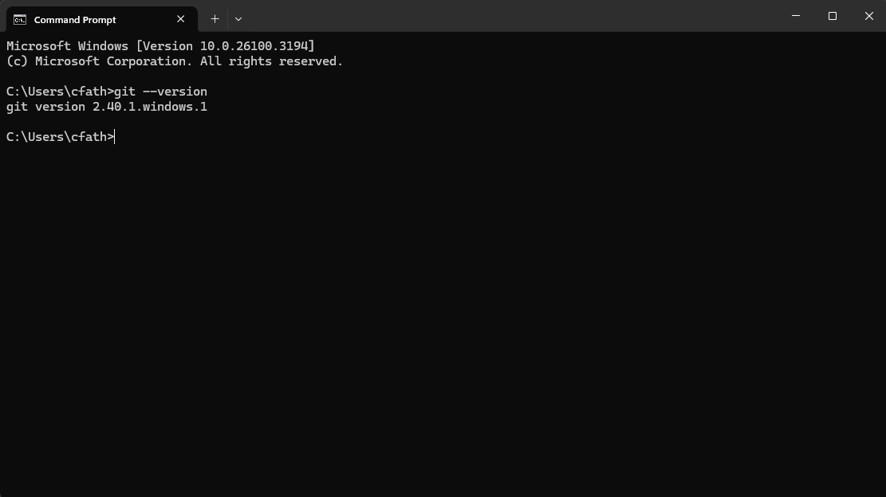
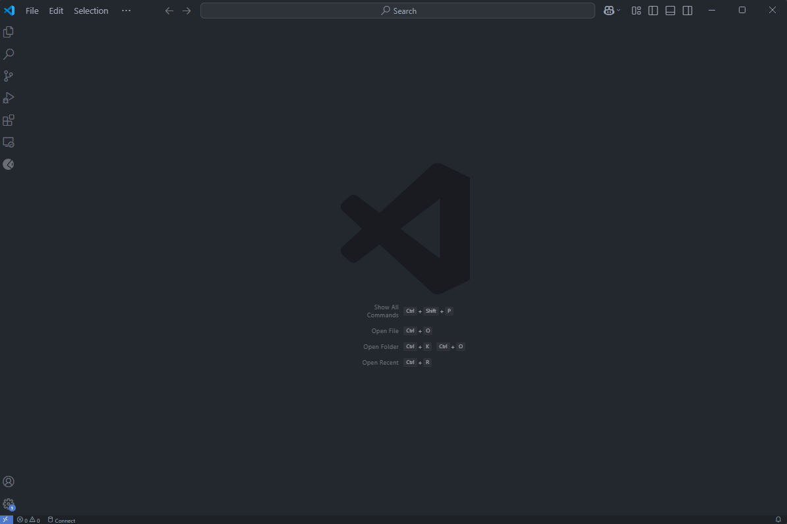
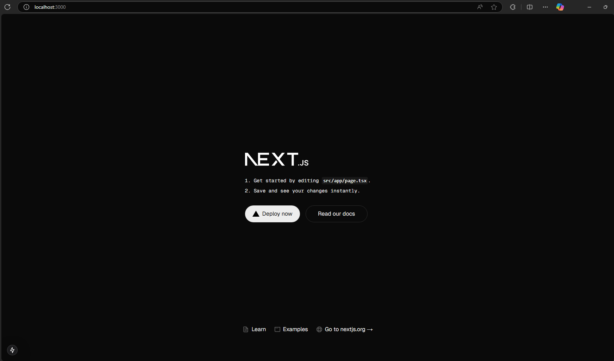
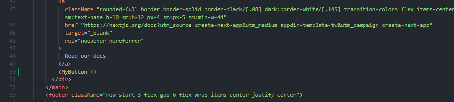
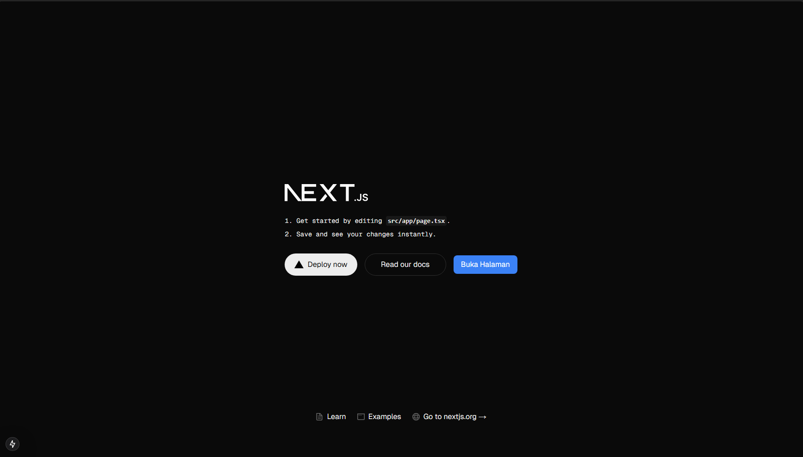
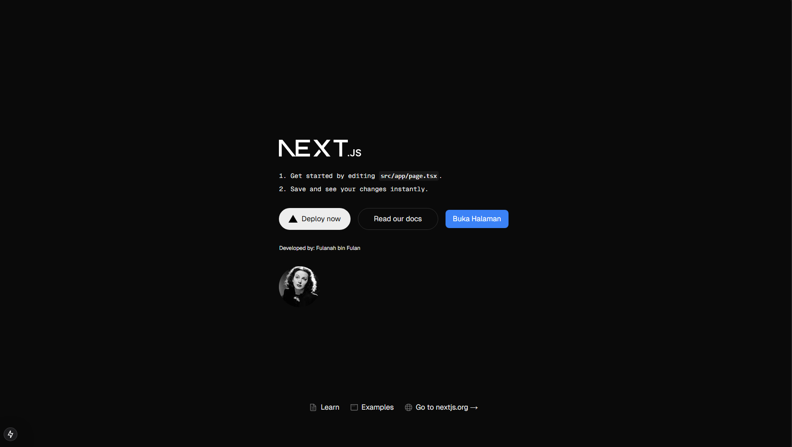

## Praktikum 1
1. Jelaskan kegunaan masing-masing dari Git, VS Code dan NodeJS yang telah Anda install pada sesi praktikum ini
2. Buktikan dengan screenshoot yang menunjukkan bahwa masing-masing tools tersebut telah berhasil terinstall di perangkat Anda!

**Jawab :**
1. Kegunaan dari Git, VS Code dan NodeJS adalah sebagai berikut
	1. Git merupakan alat pengembangan perangkat lunak yang berfungsi sebagai *version control system* untuk meyimpan, mengelola, dan berbagi *source code* secara efisien dan kolaboratif.
	2. Visual Studio Code (VS Code) merupakan aplikasi *code editor* yang ditujukan untuk pengembangan sebuah perangkat lunak. VS Code dapat digunakan untuk mengedit source code berbagai bahasa dan memiliki berbagai macam *extension* yang dapat digunakan sesuai kebutuhan 
	3. Node.js adalah runtime environment untuk JavaScript yang bersifat open-source serta cross-platform. Dengan Node.js kita dapat menjalankan kode JavaScript di mana pun, tidak hanya terbatas pada *environment* browser. Selain itu Node.js juga menyediakan banyak library/module yang membantu menyederhanakan pengembangan aplikasi web.
2. Berikut screenshoot dari masing-masing *tools*
	1. Git 
	2. Visual Studio Code 
	3. Node.js 

## Praktikum 2
1. Pertanyaan Praktikum 2 1. Pada Langkah ke-2, setelah membuat proyek baru menggunakan Next.js, terdapat beberapa istilah yang muncul. Jelaskan istilah tersebut, TypeScript, ESLint, Tailwind CSS, App Router, Import alias, App router, dan Turbopack!
2. Apa saja kegunaan folder dan file yang ada pada struktur proyek React yang tampil pada gambar pada tahap percobaan ke-3! 
3.  Buktikan dengan *screenshoot* yang menunjukkan bahwa tahapan percobaan di atas telah berhasil Anda lakukan.

**Jawab**
1.  Istilah-istilah pada langkah ke-2 adalah sebagai berikut:
	- TypeScript : Merupakan superset sintaksis JavaScript yang menambahkan pengetikan optional statis.
	- ESlint : Merupakan alat anailisis kode statis untuk mengidentifikasi pola masalah yang ditemukan pada kode javascript
	- Tailwind CSS : Tailwind CSS adalah framework CSS yang mengutamakan utilitas yang memudahkan pembuatan desain custom tanpa harus menulis CSS custom.
	- App Router : App Router di Next.js adalah sistem routing pada Next.js yang diperkenalkan sejak Next.js 13.
	- Import Alias :  Shortcut khusus yang digunakan untuk merujuk modul di codebase
	- Turbopack : Bundler tambahan yang dioptimalkan untuk JavaScript dan TypeScript,

2.  Kegunaan pada folder dan file pada langkah ke-3 adalah sebagai berikut :
	- .next : Berisi output build, seperti file JavaScript yang dikompilasi dan cache.
	- node_modules : Berisi semua dependensi yang diinstal melalui npm atau yarn, termasuk library yang diperlukan oleh Next.js.
	- public : Folder tempat menyimpan aset statis seperti gambar, ikon, dan file lainnya
	- src/app : Direktori utama dalam arsitektur App Router Next.js
	- favicon.ico : Ikon yang ditampilkan di tab browser untuk aplikasi Next.js.
	- globals.css : File CSS global yang diterapkan di seluruh aplikasi.
	- layout.tsx : File yang digunakan dalam App Router untuk mendefinisikan layout utama yang membungkus semua halaman.
	- page.tsx : File yang berisi halaman utama (/) aplikasi Next.js dalam sistem App Router.
	- .gitognore : File yang berisi daftar file atau folder yang harus diabaikan oleh Git.
	- eslint.config.mjs : Konfigurasi ESLint yang digunakan untuk memastikan standar kode JavaScript/TypeScript.
	- next-env.d.ts : File deklarasi TypeScript yang dibuat secara otomatis oleh Next.js untuk memberikan dukungan TypeScript yang lebih baik.
	- next.config.ts : File konfigurasi utama untuk Next.js, tempat mengatur fitur seperti Image Optimization, rewrites, redirects, dan lainnya.
	- package-lock,json : File yang dihasilkan secara otomatis oleh npm, menyimpan informasi dependensi proyek secara spesifik agar instalasi tetap konsisten.
	- package.json : File yang mendefinisikan metadata proyek, dependensi, skrip, dan konfigurasi lainnya untuk proyek Next.js.
	- postcss.config.mjs : Konfigurasi PostCSS, sering digunakan bersama Tailwind CSS untuk mengelola styling proyek.
	- README.md : Dokumen yang biasanya berisi informasi tentang proyek, cara instalasi, dan cara penggunaannya.
	- tailwind.config.ts : Konfigurasi untuk Tailwind CSS, digunakan untuk mengatur tema, responsivitas, dan styling kustom.
	- tsconfig.json : Konfigurasi TypeScript untuk mengatur opsi seperti strict mode, path alias, dan lainnya dalam proyek Next.js.

3. *Screenshoot Homepage* 

## Praktikum 3
1. Buktikan dengan screenshoot yang menunjukkan bahwa tahapan percobaan di atas telah berhasil Anda lakukan! 
	*Screenshot* menambahkan component React (button) :
	
	
## Praktikum 4
1. Untuk apakah kegunaan sintaks user.imageUrl?
2. Buktikan dengan screenshoot yang menunjukkan bahwa tahapan percobaan di atas telah berhasil Anda lakukan!

**Jawab**
1. Digunakan untuk mengambil sumber gambar profile dari user. 
2. *Screenshot* percobaan
	
